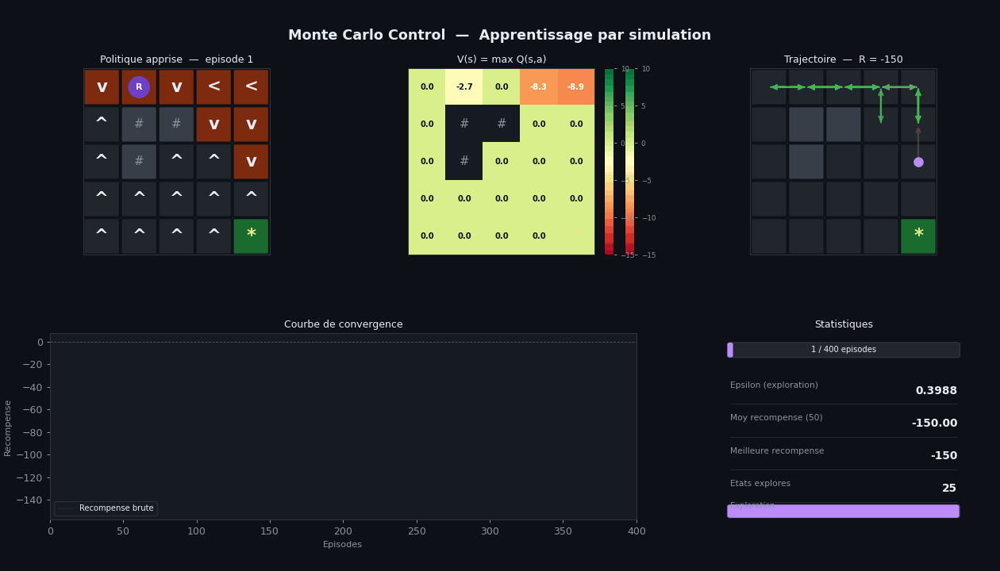

# Monte-Carlo-Control-RL
Optimisation de politiques RL par Monte Carlo Control, analyse statistique de la convergence.



## 📖 Description

Ce projet présente une étude statistique rigoureuse de la méthode **Monte Carlo Control** pour l'optimisation des politiques dans les **Processus Décisionnels de Markov** (MDP). Plutôt que de se concentrer uniquement sur la performance de l'agent, l'analyse porte sur les propriétés statistiques des estimateurs eux-mêmes : non-biais, convergence, vitesse de convergence et variance.

Le projet est structuré en cinq phases :

- **Phase 1** — Fondements théoriques : MDP, propriété de Markov, équation de Bellman, démonstration de la convergence des estimateurs Monte Carlo (loi des grands nombres, théorème central limite)
- **Phase 2** — Implémentation d'un environnement GridWorld et d'un agent Monte Carlo Control avec exploration ε-greedy
- **Phase 3** — Analyse statistique approfondie : distribution des retours, tests de normalité (Shapiro-Wilk), comparaison de variance (test de Welch), diagnostic de convergence (critère de Gelman-Rubin), autocorrélation
- **Phase 4** — Réduction de variance par Importance Sampling (off-policy), étude du biais-variance tradeoff
- **Phase 5** — Synthèse comparative des quatre estimateurs étudiés

## 📁 Structure du repository
## 🚀 Installation et utilisation

```bash
pip install numpy matplotlib scipy pillow

# Générer toutes les figures des 5 phases
python code/projet_complet.py

# Générer l'animation GIF
python code/demo_live.py
```

## 📊 Résultats clés

- Validation empirique de la convergence en **O(1/√N)** prédite par le TCL
- Diagnostic de convergence par le critère de **Gelman-Rubin** (R̂ < 1.1)
- Démonstration du **biais-variance tradeoff** entre IS ordinaire et IS pondéré
- Tous les estimateurs convergent vers la même politique optimale

## 📄 Rapport

Le rapport complet (théorie, démonstrations, résultats et discussion) est disponible dans [`Rapport_Monte_Carlo_Control_RL.pdf`](Rapport_Monte_Carlo_Control_RL.pdf).

## 🛠️ Technologies

Python · NumPy · Matplotlib · SciPy · LaTeX

## 👤 Auteur

**Issam Legssair** — Étudiant en Statistique et Big Data, INSEA Rabat
